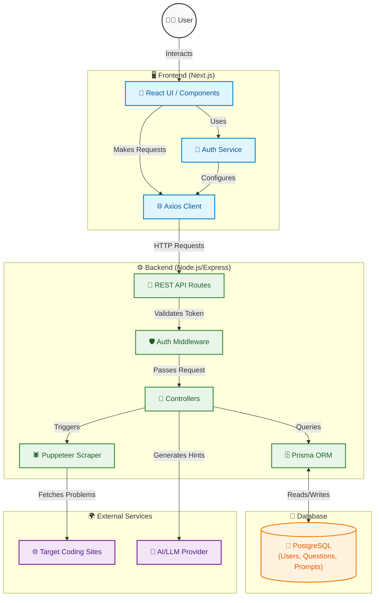

# Solvify

## 🚀 Overview
Solvify is a modern, full-stack web application designed to help users enhance their coding skills. By integrating automated question scraping and an AI-powered prompt system, Solvify offers a seamless platform for users to discover, solve, and track programming challenges. It aims to bridge the gap between learning and practice by providing real-time problem-solving environments and personalized AI assistance.

## 🧠 Features
- **User Authentication**: Secure signup and login using JWT and bcrypt.
- **AI Prompt System**: Integrated AI assistance to help users with hints, explanations, and code reviews.
- **Progress Tracking**: Keep track of solved questions and overall performance metrics.
- **Modern UI**: Fully responsive, animated, and accessible frontend built with Next.js 16, Tailwind CSS v4, and Framer Motion.
- **Robust Backend**: Fast and scalable REST API powered by Node.js, Express, and PostgreSQL via Prisma ORM.

## 🛠️ Tech Stack

### Frontend
- **Framework**: Next.js 16 (App Router)
- **Library**: React 19
- **Styling**: Tailwind CSS v4
- **Animations**: Framer Motion
- **Icons**: Lucide React
- **HTTP Client**: Axios

### Backend
- **Runtime**: Node.js
- **Framework**: Express.js
- **Web Scraping**: Puppeteer Core
- **Authentication**: JWT (JSON Web Tokens), bcryptjs
- **Language**: TypeScript

### Database & DevOps
- **Database**: PostgreSQL
- **ORM**: Prisma
- **Linting & Formatting**: ESLint
- **Development Tools**: Nodemon, tsx

## 📂 Project Structure

```text
solvify-round-2/
├── backend/                  # Node.js/Express backend
│   ├── prisma/               # Database schema and migrations
│   │   └── schema.prisma     # Prisma schema defining User, Question, PromptQuery, etc.
│   ├── src/                  # Backend source code
│   │   ├── controllers/      # Route handlers (auth, scrapper, questions)
│   │   ├── middlewares/      # Express middlewares (e.g., auth protection)
│   │   ├── routes/           # API route definitions
│   │   ├── services/         # Business logic and external service integrations
│   │   └── server.ts         # Express server entry point
│   └── package.json          # Backend dependencies and scripts
│
└── client/                   # Next.js frontend
    ├── app/                  # Next.js App Router pages and layouts
    ├── component/            # Reusable React components (Navbar, Hero, Login, etc.)
    ├── lib/                  # Utility functions and Axios client configuration
    ├── services/             # Frontend services for API communication (e.g., authService)
    ├── public/               # Static assets
    └── package.json          # Frontend dependencies and scripts
```

## 🧩 System Architecture
The system follows a standard client-server architecture. The Next.js frontend communicates with the Node.js/Express backend via RESTful APIs using Axios. The backend handles business logic, including user authentication, web scraping using Puppeteer, and AI prompt processing. Data is persistently stored in a PostgreSQL database, managed through Prisma ORM. JWTs are used to secure protected routes, ensuring that only authenticated users can submit answers, use the AI assistant, or trigger the web scraper.

## 🖼️ Architecture Diagram



## 📡 API Endpoints

### Authentication
- `POST /api/signup`: Register a new user account.
- `POST /api/login`: Authenticate a user and return a JWT.

### Questions & Scraping
- `POST /api/scrapper`: (Protected) Trigger the web scraper to fetch new coding questions.
- `GET /api/:id`: Retrieve details of a specific question by its ID.
- `POST /api/:id/submit`: (Protected) Submit an answer or solution for a specific question.